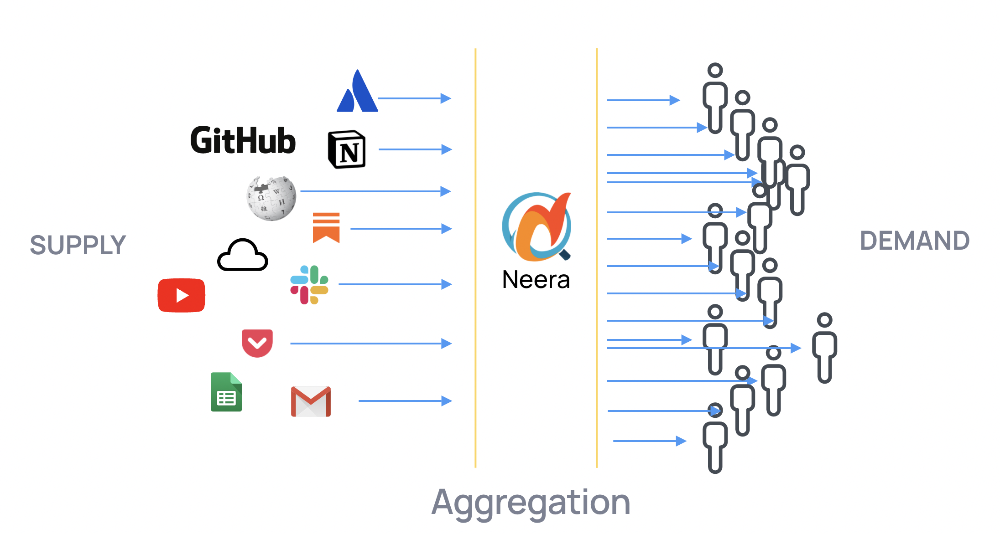

Few weeks ago, I briefly talked about how [Neera is “Amazon for Search”.](https://hargup.substack.com/p/amazon-for-search) [1]

I explained the concept more visually here:

https://drive.google.com/file/d/1dGIozwbDBo0aQyYfufrXBw9lDeMiH92B/view

The important point is that Amazon is a marketplace. It connects demand with supply, making it easier for seller to sell, buyer to buy. I bought a beautiful rug online, it came from Jalandhar to Bangalore. Pre Amazon (or Flipkart) era, I had no way to buy from that seller and that seller had no means to sell to me. [2]

Now, search is the window to the Internet. Search is the way we make sense of the explosion of information which has happened around us. You [want to search all kind of things, from all kind of places](https://hargup.substack.com/p/one-search-to-rule-them-all). Unfortunately your present search experience is limited by what Google decides to do. It does a good job at web search, it has created specific search engines for few other things like image search, news search, Google Scholar and Google Patents. But, even with the amount of money and muscle Google has, they cannot solve search for everyone. The only way we can solve search for everyone is by allowing people to solve it for each other. I want to search on HackerNews, someone has created a [search on HackerNews](https://deephn.org/). You want a search on podcast, someone has created a [search on podcasts](https://www.listennotes.com/). [3] And there are hundreds of other use cases. We want to be the place, where these search providers can find you, and through these awesome search providers, **you can find whatever you want**.

<!--truncate-->

Further Readings:

- [Aggregation Theory by Ben Thompson](https://stratechery.com/aggregation-theory/)

---

<small>

[1] Another analogy is “iOS for search”. People do everything on their iPhones, but they are not limited by the number of things Apple allows them to do. Apple doesn’t have to create a movie app for you to watch movies on your phone.

[2] It’s a point about marketplaces generally, and not in specific to Amazon.

[3] There are tons of niche search engines online, [same.energy](https://same.energy/) is my favorite. Should compile a list and post here.

_This was originally published on https://hargup.substack.com/p/amazon-for-search-re-explained_

</small>
