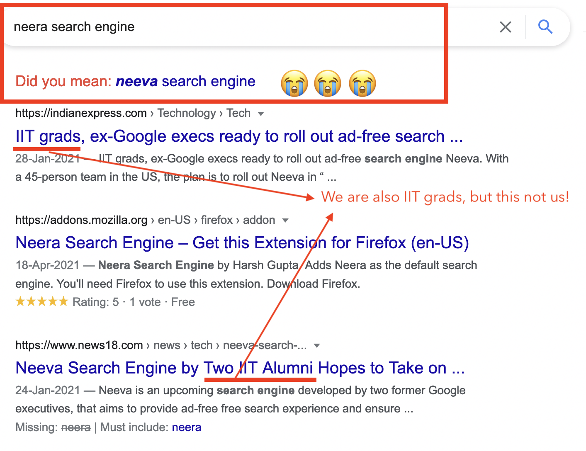

[Neera](https://neera.ai) is now called [Felvin](https://felvin.com)! Felvin is the younger, stronger, smarter
nephew of the wizard
[Merlin](https://en.wikipedia.org/wiki/Merlin). Out on a quest to
write his own story. Whatever you want, Felvin will find it for you.

**Why change names?**

We chose the name Neera because it means water. It allows you to be in
"flow", it quenches your thirst for curiosity, It takes whatever shape
you want to give it.

Back then we weren't aware of Neeva, like us they are trying to
reimagine how we find information. They have been in the scene for a
little longer, and this is what happens when you search for Neera using
Google or Bing.

People were getting confused. Even friends thought perhaps we made a
typo 😬. And then, another company pivoted, changed their business model
and called themselves NIRA
([https://nira.com/](https://nira.com/)) 🙈

We realized that continuing with the name "Neera" is only going to hurt
us. Being water also means being willing to adapt according to the
demands of the situation. So we decided to change the name.

**Why Felvin?**

We were looking for a name that is short, easy to remember and has a
dotcom domain available. After a lot of work, we invented the name
"Felvin". Felvin is short, and sweet, just six characters. It turns out
the word is not new, but it is fairly unique and we were not only able
to get a dotcom but a lot of its variations as well :P including
[felv.in](http://felv.in)

It has been little over a month since we decided on Felvin, and we have
grown to really like it.

I hope Felvin is able to cast some magic on you, and the world. 🪄✨
