Last weekend at Felvin, we hosted an open source hackathon on instant apps. The purpose was twofold, one to give students a little nudge to create instant apps, two to stress test our instant apps system and see how easy it is for people to create instant apps. Happy to call the Hackathon a success on both fronts. Each participant created 4.5 instant apps on average in less than 48 hours. Either the participants were very motivated or we made it very easy for them to create the instant apps or both 😉.

# Here are our winners:

## Nehal Sharma

### Bio

👋 I am Nehal Sharma, a 2nd year student at IIIT Lucknow, studying Computer Science. I enjoy web development, and love contributing to open source. These days I'm engrossed in Hacktoberfest, and it's been both hectic and fun, and of course full of learning! Thanks to this project, I learnt how to write styled components, and brushed up my React skills this weekend.

GitHub: [@N-Shar-ma](https://github.com/N-Shar-ma)

### Apps Created

#### Markdown to HTML

Given Markdown generates corresponding HTML which has the same output as the inputted markdown, and lets the user easily copy he HTML

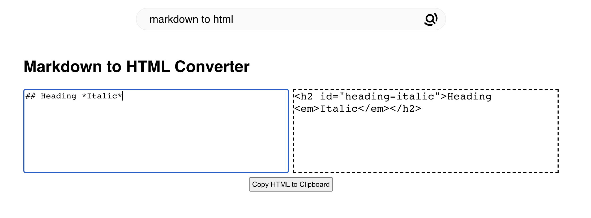

#### QR Code Generator

Encode ANY string, be it a link or plain text, in a QR code

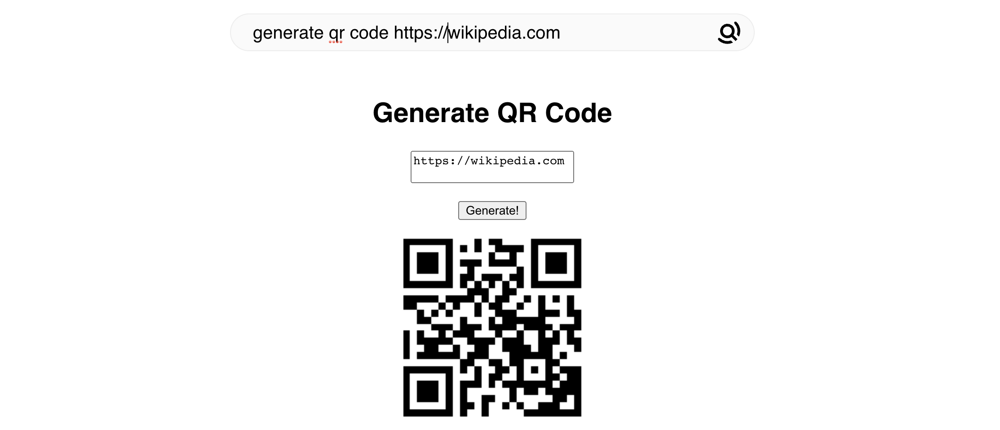

#### Website Finder

Find the icon for any website

#### Trending on GitHub

Get an overview of the top 8 trending repositories of the day without needing to go to GitHub's website

#### Merge PDFs

Merge multiple PDFs into 1 PDF

#### Hello World in multiple languages

Check out what the hello world program looks like in over 650 languages (this is an app I've personally wanted to have since long)

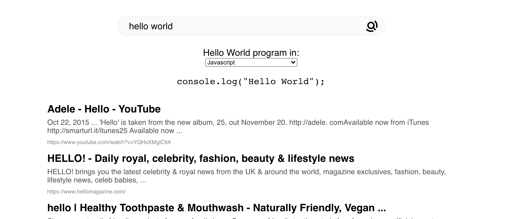

## Harsh Mishra

### Bio

Hey, I am Harsh Mishra, a Junior in ECE at IIT Dhanbad. I am a Machine Learning and an Open Source Enthusiast. This year I had my Google Summer of Code with AOSSIE organisation. I love to work on projects solving real-life problems. These days I am exploring Web Dev.

This hackathon has helped me brush up on my React Skills. I learned about many different modules, which I hadn't encountered till now. I also learned about styled-components too.

From my personal Experience, Creating Instant Apps was super cool and easy, and I'll be looking forward to contributing further.

GitHub: [@MiHarsh](https://github.com/MiHarsh)

### Apps Created

#### Flip a coin

An instant app that simulates flipping a coin and results in either Heads or Tails.

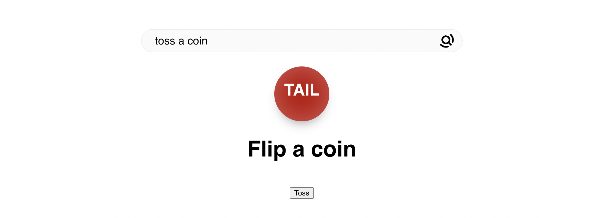

#### Unit Convertor

Users will now be able to perform Unit conversions with the support of 45 different unit types. No longer need to search for other converters.

#### Photo Hosting

A Photo hosting service Instant App that greatly facilitates everyday work with various types of graphics. It helps to create a URL for our images quickly to promote sharing them with other users easily.

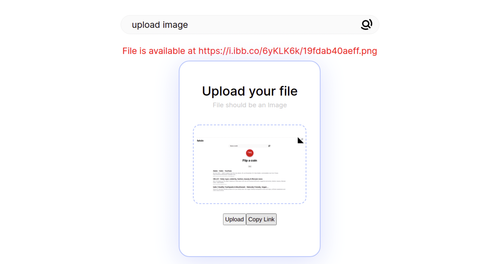

#### Image Cropper

An Instant app for cropping images, enabling easy selection, cropping and downloading images.

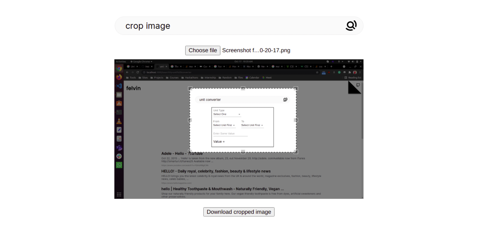

## Rajiv Harlalka

### Bio

Hola everyone 😃! Rajiv(aka: Vijard 🧙🏻‍♂️ ) this side . I am a second year UG student at IIT Kharagpur , currently motivated more towards backend engineering and web development (🕸️ <-- not this one ofc ) . Contributions to this project was start to my open-source journey and hoping to do more in the near future. Learnt a lot about UI styling and React during this hackathon as well as contributing in this project.

GitHub: [@rajivharlalka](https://github.com/rajivharlalka)

### Apps Created

#### Color Picker

Color Picker, allows user to pick colors

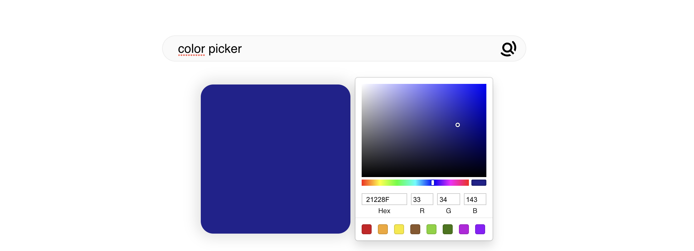

#### Crypto Prices

See live prices of crypto currencies like Bitcoin and Etherium

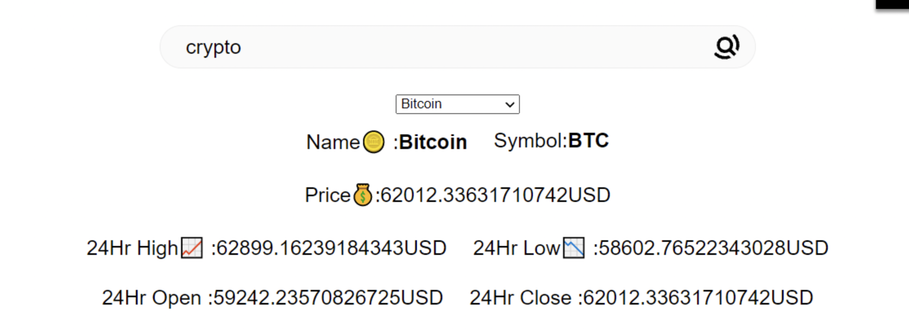

#### Live Markdown Preview

Live Markdown editor and preview

#### Image Compressor

Compresses and image to save space, can be useful for Government forms which have limit on image sizes.

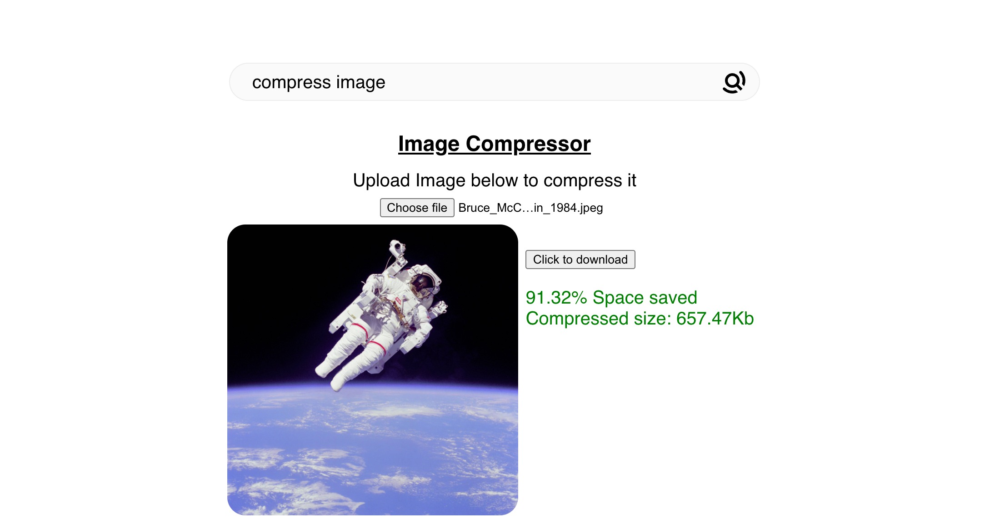

## Chirag Ghosh

### Bio

Heya! Chirag here. I am a student interested in coding and trying to fit in the open-source world. I love web development ( frontend more ). Also, I love clicking photos.

GitHub: [@chirag828049](https://github.com/chirag828049)

### Apps Created

#### JWT Token decoder

[PR Link](https://github.com/felvin-search/instant-apps/pull/181)This instant app will help developers validate the JWT tokens.
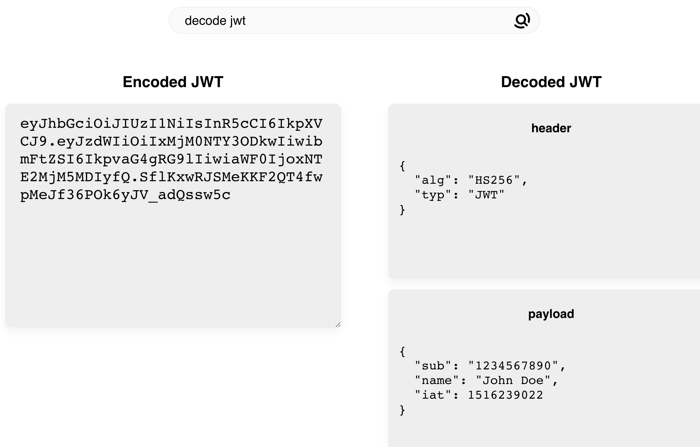

#### Pokedex

[PR Link](https://github.com/felvin-search/instant-apps/pull/189) :
Ofcourse the pokemon world is lovely. Fulfilling the love for pokemon is an instant app a.k.a mini pokedex.

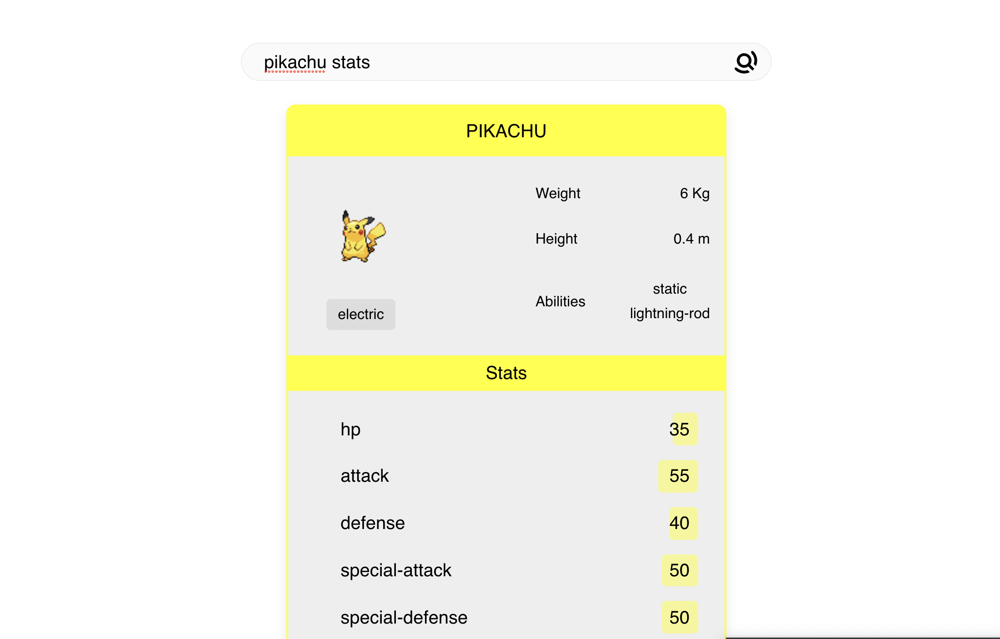

#### The TV Shows app

[PR Link](https://github.com/felvin-search/instant-apps/pull/190)
My friends suggest me various TV series all day. Getting info about them with just one click is kinda a necessity now. This app caters to that need.
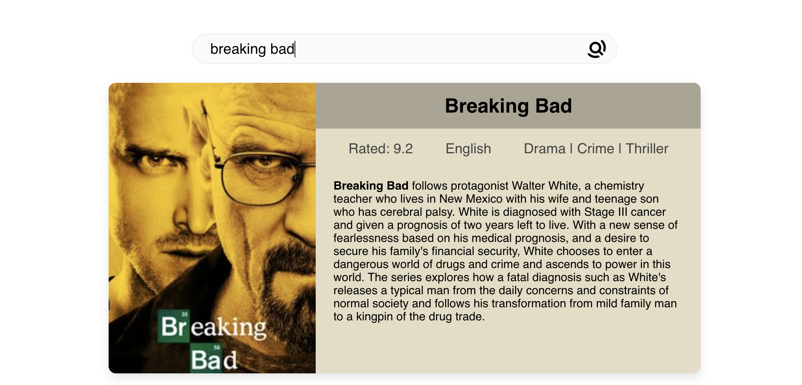

#### URL Shortener

[PRLink](https://github.com/felvin-search/instant-apps/pull/194) : No more lengthy urls. cut them short. (Bonus: Rickroll your friends using a different link. Satisfaction!).

