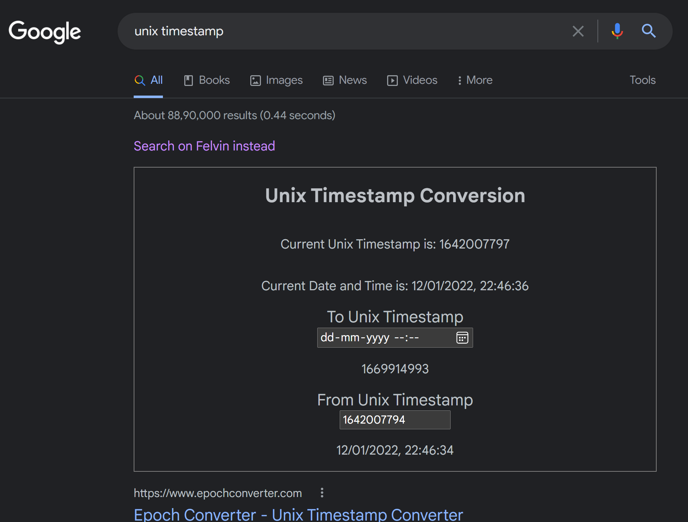

Abandoning the comfortable familiarity of Google and changing your default search engine to Felvin can be a big leap to take for some. That's why I made a browser extension to make the switch much more smooth for anyone curious about Felvin! **The Felvin Instant Apps Browser Extension allows you to benefit from the full range of Instant Apps right inside the Google Search Page**, without needing to change search engines, if you're not yet ready to take the leap.

Coming soon to the Chrome Web Store!

## A Bumpier Development Journey Than Expected...
At a basic level, the extension aimed to import the Felvin apps package, choose the best match out of these apps for the query searched, and inject the instant app into the search page. Sounds pretty easy at first, but the fact that the apps are React components, and that there's no standard way to make extensions using anything other than plain JavaScript was a challenge. Adding to the complexity, web standards for extensions evolve continuously, which renders most blogs on creating React extensions outdated. 

However, figuring out how to make React work for an extension and writing the Webpack config (to bundle the extension code) from scratch, was what made the process so much fun!

The `content script` of the extension, which runs whenever you're on a Google search page, is what does all the instant app magic: It runs the searched query through the list of the imported Instant Apps until it finds a match, and then renders it onto the page into a `div` injected at the top of the search results. 

### Webpack Woes... Or Wonders?! ✨
Dealing with Webpack initially seemed daunting, well... it still does! But the more I research on and use it, the more comfortable I get with it, and appreciate it as a development tool. I read a lot of its documentation and several blogs on configuring it for React, without `create-react-app`, which would have been overkill for this extension, and my first draft of the config seemed to work well. However, on importing the apps package, I started getting a strange error about the `content script` not being ASCII encoded. After some more searching around, I realised I'd also need to configure the default code minimizer used by Webpack, which I did. Now it worked just fine!

### Styled Components To The Rescue! 💅
Care had to be taken to ensure that the extension doesn't break or interrupt any of the original functionality of the page. This is where the usage of `styled-components` for the apps came in handy, since the app styles didn't "leak" out. I kept the additional CSS to a minimum, just enough so that the injected content is boxed in a suitably sized space which does not hide behind or cover the original content.

### Original Is Still The Best!
Of course, we believe that Felvin Instant Apps work the best in their own natural habitat, aka [Felvin Search](https://felvin.com), and so there's an ever-present link to the exact same query searched on Felvin. Whenever curiosity strikes, you can simple click on "Search on Felvin instead" and seamlessly switch from Google to Felvin. 